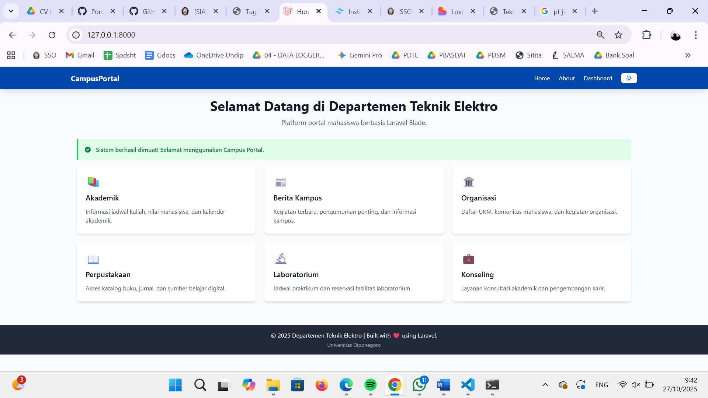
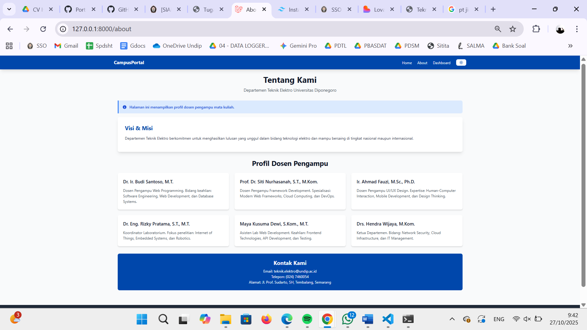
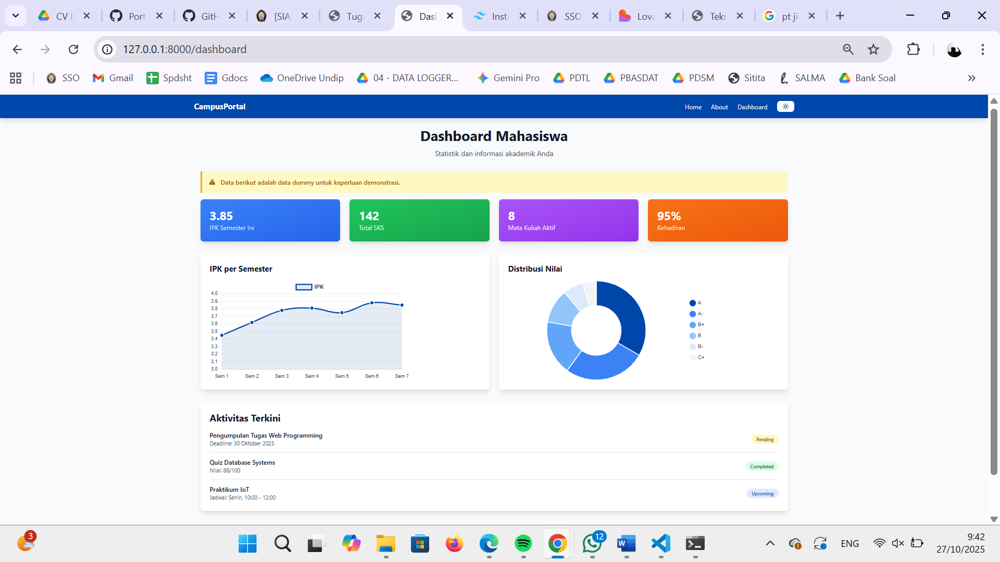
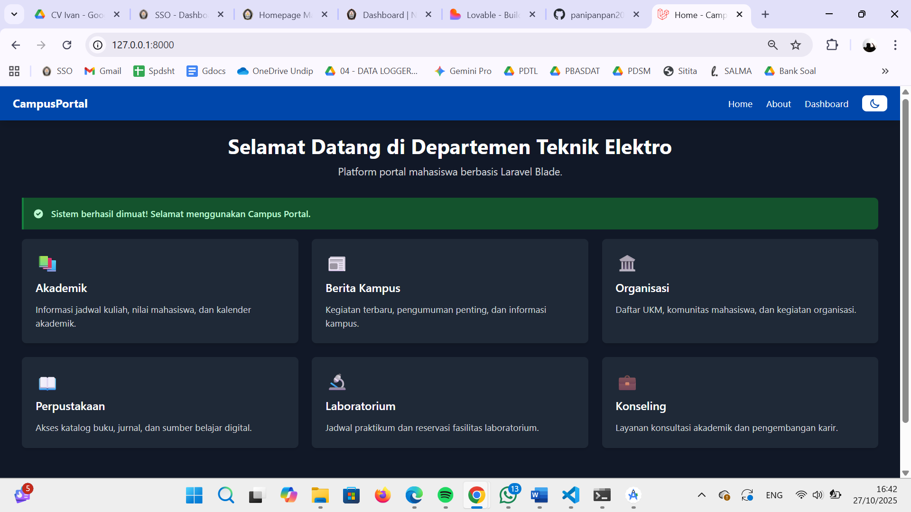

# 🎓 Campus Portal - Departemen Teknik Elektro

[](https://laravel.com)
[](https://tailwindcss.com)
[](https://www.chartjs.org)
[](https://vitejs.dev)

Portal mahasiswa berbasis Laravel dengan Blade templating, Tailwind CSS, dan Chart.js untuk Departemen Teknik Elektro Universitas Diponegoro.

---

## 📋 Table of Contents

- [Features](#-features)
- [Demo Screenshots](#-demo-screenshots)
- [Tech Stack](#-tech-stack)
- [Prerequisites](#-prerequisites)
- [Installation](#-installation)
- [Project Structure](#-project-structure)

---

## ✨ Features

### 🎯 Core Features
- ✅ **Blade Layout System** - Master layout dengan `@extends`, `@section`, `@yield`
- ✅ **Reusable Blade Components** - Navbar, Footer, Card, Alert components
- ✅ **Modern Asset Bundling** - Vite untuk CSS & JavaScript
- ✅ **Tailwind CSS** - Utility-first CSS framework
- ✅ **Responsive Design** - Mobile-first, adaptif untuk semua ukuran layar

### 🌟 Bonus Features
- ✅ **Dark Mode Toggle** - Dengan persistent state (localStorage)
- ✅ **Interactive Charts** - Chart.js dengan 2 grafik (Line & Doughnut)
- ✅ **Alert Component** - 4 tipe notifikasi (success, error, warning, info)
- ✅ **Custom Theme** - Warna Undip Blue (#0047AB)
- ✅ **Smooth Animations** - Hover effects & transitions

---

## 📸 Demo Screenshots

### Home Page

- Hero section dengan welcome message
- 6 card components dengan icon
- Alert notification
- Responsive grid layout

### About Page

- Profil 6 dosen pengampu
- Visi & Misi departemen
- Informasi kontak

### Dashboard

- 4 statistik cards (IPK, SKS, Mata Kuliah, Kehadiran)
- Line Chart - IPK per semester
- Doughnut Chart - Distribusi nilai
- Recent activities timeline

### Dark Mode

- Toggle button di navbar
- Smooth color transition
- Persistent state

---

## 🛠️ Tech Stack

| Technology | Version | Purpose |
|------------|---------|---------|
| **Laravel** | 11.x | PHP Framework |
| **Blade** | Built-in | Templating Engine |
| **Tailwind CSS** | 3.4.0 | CSS Framework |
| **Vite** | 5.x | Asset Bundler |
| **Chart.js** | 4.4.0 | Data Visualization |
| **Alpine.js** | - | Optional (not used) |

---

## 📦 Prerequisites

Pastikan sudah terinstall:

- **PHP** >= 8.2
- **Composer** >= 2.x
- **Node.js** >= 18.x
- **npm** >= 9.x
- **Git** (optional)

Check versi:
```bash
php --version
composer --version
node --version
npm --version
```

---

## 🚀 Installation

### 1️⃣ Clone Repository

```bash
git clone https://github.com/username/campus-portal.git
cd campus-portal
```

Atau buat project baru:
```bash
composer create-project laravel/laravel campus-portal
cd campus-portal
```

---

### 2️⃣ Install PHP Dependencies

```bash
composer install
```

---

### 3️⃣ Install Node Dependencies

```bash
npm install
```

---

### 4️⃣ Install Tailwind CSS & Chart.js

```bash
# Install Tailwind CSS
npm install -D tailwindcss postcss autoprefixer

# Generate Tailwind config
npx tailwindcss init -p

# Install Chart.js
npm install chart.js
```

---

### 5️⃣ Setup Environment

```bash
# Copy .env file
cp .env.example .env

# Generate application key
php artisan key:generate
```

**Edit `.env`** (optional):
```env
APP_NAME="Campus Portal"
APP_URL=http://127.0.0.1:8000
```

---

### 6️⃣ Create Components

```bash
php artisan make:component Navbar
php artisan make:component Footer
php artisan make:component Card
php artisan make:component Alert
```

---

### 7️⃣ Create Directories

```bash
# Windows
mkdir resources\views\layouts
mkdir resources\views\pages

# Linux/Mac
mkdir -p resources/views/layouts
mkdir -p resources/views/pages
```

---

### 8️⃣ Copy All Files

Copy semua file dari repository ke lokasi yang sesuai (lihat [Project Structure](#-project-structure)).

---

### 9️⃣ Run Application

**Terminal 1 - Laravel Server:**
```bash
php artisan serve
```

**Terminal 2 - Vite Dev Server:**
```bash
npm run dev
```

---

### 🌐 Access Application

Open browser:
- **Home**: http://127.0.0.1:8000
- **About**: http://127.0.0.1:8000/about
- **Dashboard**: http://127.0.0.1:8000/dashboard

---

## 📁 Project Structure

```
campus-portal/
│
├── 📂 app/
│   ├── Http/
│   │   └── Controllers/
│   └── View/
│       └── Components/
│           ├── Alert.php
│           ├── Card.php
│           ├── Footer.php
│           └── Navbar.php
│
├── 📂 resources/
│   ├── 📂 css/
│   │   └── app.css                      # Tailwind directives
│   │
│   ├── 📂 js/
│   │   ├── app.js                       # Dark mode + Chart.js logic
│   │   └── bootstrap.js                 # Laravel bootstrap
│   │
│   └── 📂 views/
│       ├── 📂 layouts/
│       │   └── app.blade.php            # Master layout
│       │
│       ├── 📂 components/
│       │   ├── navbar.blade.php         # Navigation bar
│       │   ├── footer.blade.php         # Footer
│       │   ├── card.blade.php           # Reusable card
│       │   └── alert.blade.php          # Alert notifications
│       │
│       └── 📂 pages/
│           ├── home.blade.php           # Homepage
│           ├── about.blade.php          # About page
│           └── dashboard.blade.php      # Dashboard with charts
│
├── 📂 routes/
│   └── web.php                          # Web routes
│
├── 📂 public/
│   ├── build/                           # Compiled assets (auto-generated)
│   └── index.php
│
├── 📄 tailwind.config.js                # Tailwind configuration
├── 📄 postcss.config.js                 # PostCSS configuration
├── 📄 vite.config.js                    # Vite configuration
├── 📄 package.json                      # Node dependencies
├── 📄 composer.json                     # PHP dependencies
├── 📄 .env                              # Environment variables
└── 📄 README.md                         # This file
```

---

## 📚 Documentation References

- **Laravel Documentation**: https://laravel.com/docs
- **Blade Templates**: https://laravel.com/docs/blade
- **Tailwind CSS**: https://tailwindcss.com/docs
- **Chart.js**: https://www.chartjs.org/docs
- **Vite**: https://vitejs.dev/guide

---

## 🔧 Development Commands

### Common Commands

```bash
# Clear all caches
php artisan optimize:clear

# Clear specific cache
php artisan config:clear
php artisan cache:clear
php artisan view:clear
php artisan route:clear

# Build for production
npm run build

# Run development server
npm run dev

# Watch for changes
npm run dev

# Format code (if prettier installed)
npm run format
```

---

## 🎓 Learning Resources

### Laravel Blade
- [Official Blade Docs](https://laravel.com/docs/blade)
- [Laracasts - Blade Series](https://laracasts.com)

### Tailwind CSS
- [Tailwind Play](https://play.tailwindcss.com) - Online playground
- [Tailwind Components](https://tailwindcomponents.com) - Component library
- [Headless UI](https://headlessui.com) - Unstyled components

### Chart.js
- [Chart.js Samples](https://www.chartjs.org/docs/latest/samples/)
- [Chart.js Plugins](https://github.com/chartjs/awesome)

---

## 🤝 Contributing

Contributions are welcome! Please follow these steps:

1. Fork the repository
2. Create feature branch (`git checkout -b feature/AmazingFeature`)
3. Commit changes (`git commit -m 'Add some AmazingFeature'`)
4. Push to branch (`git push origin feature/AmazingFeature`)
5. Open Pull Request

---

## 📄 License

This project is open-sourced software licensed under the [MIT license](LICENSE).

---

**Technologies:**
- Laravel Framework - Taylor Otwell
- Tailwind CSS - Adam Wathan
- Chart.js - Chart.js Team

---

<div align="center">

**⭐ Star this repo if you find it helpful!**

Made with ❤️ by Departemen Teknik Elektro - Universitas Diponegoro

</div>